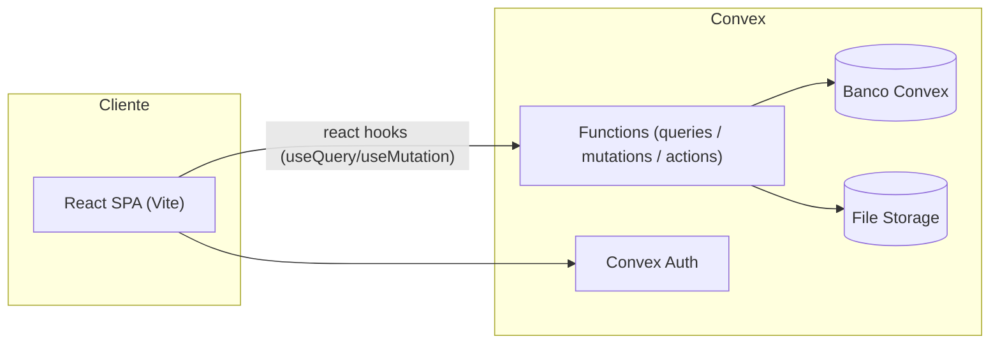
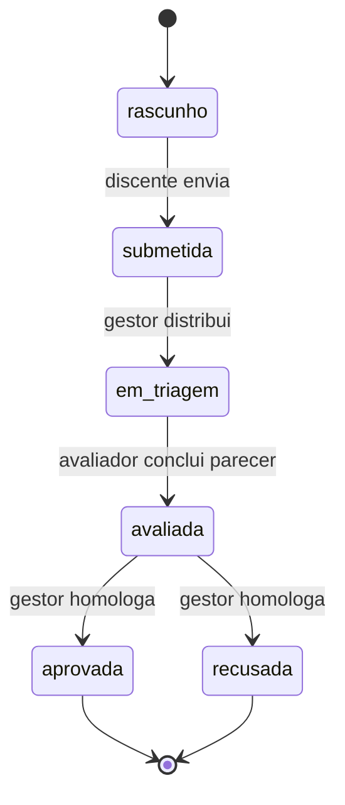

# Arquitetura — Portal de Gestão de Laboratório

> Página da wiki conectada a [[PROJECT_BRAIN]]. Define a organização do código por módulos, as camadas e o modelo de dados.

## 1. Visão geral

Aplicação **SPA React + Vite** com backend em **Convex** (banco reativo + funções serverless em TypeScript). A UI segue o design system de [[DESIGN]] e a qualidade é verificada conforme [[Qualidade]].



### Princípios

1. **Modules first** — cada domínio do portal é um módulo isolado com sua página, componentes, hooks e funções de backend.
2. **Type safety ponta a ponta** — os tipos do Convex fluem automaticamente para o frontend via `api`.
3. **Server como fonte de verdade** — validação e autorização sempre no backend; o frontend apenas reflete estado.
4. **Acessibilidade desde o início** — componentes baseados em Radix (shadcn/ui), conformidade WCAG 2.1 AA de [[DESIGN]].
5. **Design tokens centralizados** — nenhuma cor/espaçamento hardcoded; tudo via `tailwind.config` + variáveis CSS.

## 2. Estrutura de pastas

```text
portal-lab/
├── convex/                     # Backend (functions Convex)
│   ├── schema.ts               # Definição de tabelas e índices
│   ├── auth.config.ts          # Configuração do Convex Auth
│   ├── users/                  # Módulo: usuários, papéis e permissões
│   ├── editais/                # Módulo: editais, cotas, prazos
│   ├── inscricoes/             # Módulo: propostas, planos, anexos
│   ├── avaliacoes/             # Módulo: triagem, pareceres, rubrica
│   ├── relatorios/             # Módulo: relatórios parciais/finais
│   └── vitrine/                # Módulo: dados públicos de pesquisa
│
├── src/
│   ├── app/                    # Roteamento, providers, guards de papel
│   ├── components/
│   │   ├── ui/                 # shadcn/ui (primitivos gerados)
│   │   ├── layout/             # Sidebar, header, breadcrumbs, shell
│   │   └── shared/             # Componentes transversais (StatusBadge, EmptyState…)
│   ├── features/               # 1 pasta por módulo do portal
│   │   ├── auth/
│   │   ├── editais/
│   │   ├── inscricao/          # Formulário multi-etapas
│   │   ├── triagem/            # Painel do gestor + avaliadores
│   │   ├── dashboard/          # Métricas/KPIs
│   │   ├── vitrine/            # Página pública
│   │   └── relatorios/
│   ├── hooks/                  # Hooks transversais (useRole, useMediaQuery…)
│   ├── lib/                    # utils, cn(), formatadores, validadores
│   ├── styles/                 # globals.css, tokens do design system
│   └── types/                  # Tipos compartilhados (DTOs de domínio)
│
├── tests/
│   ├── unit/                   # Vitest — funções e componentes puros
│   ├── integration/            # Vitest — fluxos de functions Convex
│   └── e2e/                    # Playwright — jornadas críticas
│
├── docs/                       # Esta wiki
└── .github/workflows/          # CI: lint, typecheck, testes, build
```

### Regras de dependência entre camadas

```text
features/*  →  lib + hooks + components/shared + convex/api
components/shared  →  components/ui + lib
components/ui      →  (somente primitivos, sem lógica de domínio)
features/*  ✗→  features/outra     (comunicação por estado global ou props de rota)
convex/*    ✗→  src/*              (backend nunca importa frontend)
```

## 3. Módulos e responsabilidades

| # | Módulo | Frontend (`src/features/`) | Backend (`convex/`) | Papéis que usam |
| --- | --- | --- | --- | --- |
| M1 | **Autenticação & Acesso** | login, recuperação de senha, guards de rota | `users/`: CRUD de perfis, papéis, sessão | todos |
| M2 | **Edital & Publicação** | gestão de editais, cronograma, cotas por área | `editais/`: ciclo de vida do edital, geração de número | gestor (escrita), todos (leitura) |
| M3 | **Inscrição de Pesquisa** | formulário multi-etapas, upload de plano, rascunhos | `inscricoes/`: submissão, anexos, vínculo orientador | discente, orientador |
| M4 | **Central de Triagem** | distribuição de propostas, rubrica 0–10 com justificativa | `avaliacoes/`: atribuição, pareceres, consolidação de notas | gestor, avaliador |
| M5 | **Painel do Gestor (Métricas)** | KPIs, cotas preenchidas, produtividade | `editais/metrics.ts`: agregações reativas | gestor |
| M6 | **Vitrine Pública** | cards de pesquisa aprovada, filtros | `vitrine/`: queries públicas sem auth | visitante |
| M7 | **Relatórios & Acompanhamento** | submissão de relatórios, histórico, alertas de prazo | `relatorios/`: versões, prazos, feedback do orientador | discente, orientador, gestor |

## 4. Modelo de dados (Convex schema)

Esboço da v1 — entidades principais e relações:

```text
users        { _id, email, nome, papel: "discente"|"orientador"|"avaliador"|"gestor",
               matricula?, departamento?, orcid? }

editais      { _id, numero, titulo, programa: "PIBIC"|"PIBITI"|"INTERNO",
               status: "rascunho"|"publicado"|"em_avaliacao"|"encerrado",
               dataAbertura, dataEncerramento, cotasPorArea: [{area, total, ocupadas}] }

inscricoes   { _id, editalId, discenteId, orientadorId,
               titulo, areaCnpq, planoTrabalhoFileId, resumo,
               status: "rascunho"|"submetida"|"em_triagem"|"avaliada"|"aprovada"|"recusada",
               protocolo }   -- ex.: 23076.014821/2024-11

avaliacoes   { _id, inscricaoId, avaliadorId,
               criterios: [{nome, nota0a10, justificativa}],
               notaFinal, parecer, status: "pendente"|"concluida" }

relatorios   { _id, inscricaoId, tipo: "parcial"|"final",
               arquivoFileId, enviadoEm, feedbackOrientador?,
               status: "aguardando"|"aceito"|"devolvido" }

arquivos     { _id, storageId, nome, tamanho, mimeType, enviadoPor }
```

### Regras de integridade

- `inscricoes.protocolo` é único e gerado no backend (JetBrains Mono na UI, ver [[DESIGN]]).
- Uma `inscricao` só pode ser submetida com plano de trabalho anexado e orientador vinculado.
- `avaliacoes` segue o princípio **um avaliador ↔ uma inscrição por vez**; o gestor redistribui em caso de conflito de interesse (mesmo departamento).
- Papéis são validados **em toda função de backend** (`withUser(ctx, ["gestor"], …)`), nunca só no frontend.
- Arquivos: apenas PDF, até 10 MB (espelha o design system de [[DESIGN]]).

## 5. Fluxo de estados da inscrição



## 6. Convenções de código

| Tema | Convenção |
| --- | --- |
| Nomes de arquivos | `kebab-case.ts` (ex.: `status-badge.tsx`) |
| Componentes | função + named export; sem `default export` |
| Estado de servidor | sempre via hooks do Convex; sem Redux/Zustand na v1 |
| Formulários | react-hook-form + zod, schema compartilhado com o backend quando possível |
| Datas | armazenar como número (epoch ms); exibir com `Intl.DateTimeFormat("pt-BR")` |
| Moedas/notas | tabular numerals (`tnum`) em tabelas, conforme [[DESIGN]] |
| Erros de backend | `ConvexError<{ code: string; message: string }>` mapeados para toasts |
| Commits | Conventional Commits (`feat:`, `fix:`, `docs:` …) |
| Branches | `feat/MN-descrição` a partir de `main` |

## 7. ADRs

Decisões arquiteturais relevantes ficam registradas em [[PROJECT_BRAIN]] §7. Novas decisões seguem o formato: **Contexto → Opções → Decisão → Consequências**, numeradas sequencialmente (ADR-006, ADR-007…).

## 8. Ligações

- Escopo e personas: [[PROJECT_BRAIN]]
- Padrões visuais: [[DESIGN]]
- Quando uma tarefa está "pronta": [[Definition-of-Done]]
- Como validar o que construímos: [[Qualidade]]
