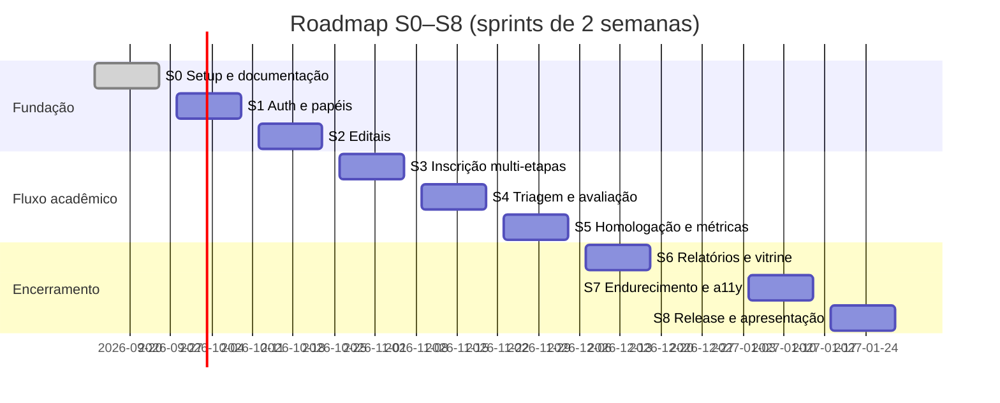

# Sprints — Portal de Gestão de Laboratório

> Página da wiki conectada a [[PROJECT_BRAIN]]. Planejamento S0–S8 com objetivos, entregas e riscos. Cada sprint tem 2 semanas (time de 5 pessoas, conforme [[Gestao-de-Projeto]]).

## 0. Linha do tempo

> Datas são estimativas de referência; o conteúdo de cada sprint é o compromisso. As datas S0/S1 consideram o início em 14/09/2026.

---

## Sprint 0 — Fundações (atual)

**Objetivo:** deixar o time pronto para construir — sem código de produto ainda, mas com tudo documentado, ferramentado e validado.

| Entrega | Detalhe |
| --- | --- |
| Documentação/wiki | [[PROJECT_BRAIN]], [[Arquitetura]], [[Sprints]], [[Backlog]], [[Qualidade]], [[Usabilidade]], [[Definition-of-Done]], [[Gestao-de-Projeto]] |
| Design system | [[DESIGN]] revisado e aprovado pelo time (mockups em `stitch_portal_pibic_conecta/`) |
| Refinamento do backlog | User stories com critérios de aceitação para S1–S3 |
| ADRs iniciais | Decisões 001–005 registradas ([[PROJECT_BRAIN]] §7) |
| (Se der tempo) scaffold | Projeto Vite + React + TS + Tailwind + shadcn/ui + Convex inicializado |

**Definition of Done da S0** (complementa [[Definition-of-Done]]): 100% das páginas da wiki criadas e revisadas por ≥ 2 membros; backlog S1–S3 refinado; design system aprovado.

**Critério de saída:** qualquer pessoa do time consegue explicar o fluxo ponta a ponta (edital → inscrição → triagem → relatório) usando apenas a wiki.

---

## Sprint 1 — Autenticação e níveis de acesso (M1)

**Objetivo:** qualquer persona acessa o portal com o papel correto.

- Setup do projeto (Vite + React + TS + Tailwind + shadcn/ui + Bun) — se não ocorrer na S0
- Convex Auth: login por e-mail/senha, recuperação de senha
- Modelo `users` com papéis (discente, orientador, avaliador, gestor) e guard de rotas
- Layout base do app (sidebar responsiva, breadcrumbs) seguindo [[DESIGN]]
- Pipeline de CI: lint + typecheck + testes no PR
- E2E "smoke": login em cada papel

**Riscos:** configuração inicial do Convex Auth (mitigação: spike no 1º dia); definição de permissões refinada demais (mitigação: 4 papéis fixos, ADR-004).

---

## Sprint 2 — Edital & Publicação (M2)

**Objetivo:** gestor publica um edital com cotas e prazos.

- CRUD de editais com ciclo de vida (rascunho → publicado → encerrado)
- Cotas por subárea CNPq com validação de consistência
- Listagem pública de editais abertos (base para a vitrine)
- Notificação in-app de "edital publicado"
- Testes de integração das functions e E2E do fluxo do gestor

**Risco:** modelagem de cotas por área (mitigação: spike de schema no 1º dia; revisão por pares com Ana).

---

## Sprint 3 — Inscrição de Pesquisa (M3)

**Objetivo:** discente submete proposta completa com plano de trabalho.

- Formulário multi-etapas (dados → projeto → anexos → revisão) com stepper de [[DESIGN]]
- Upload de PDF (até 10 MB) via Convex Storage com barra de progresso
- Vínculo discente ↔ orientador com aprovação do orientador
- Protocolo único gerado no backend (formato CNPq)
- Rascunho automático (salvar estado parcial)
- E2E da jornada completa do discente

**Risco:** UX do multi-step em mobile (mitigação: teste de usabilidade antecipado — ver [[Usabilidade]] roteiro T3).

---

## Sprint 4 — Central de Triagem e Avaliação (M4)

**Objetivo:** gestor distribui propostas e avaliadores emitirem pareceres com rubrica.

- Fila de propostas submetidas com filtros (edital, área, status)
- Atribuição de avaliadores com checagem de conflito de interesse (mesmo departamento)
- Rubrica 0–10 por critério com justificativa obrigatória (dual-pane do [[DESIGN]])
- Consolidação de notas e ranking por edital
- E2E do fluxo avaliador + testes de integração de consolidação

**Risco:** justiça percebida do processo (mitigação: justificativa obrigatória e auditoria de alterações).

---

## Sprint 5 — Homologação e Painel do Gestor (M5)

**Objetivo:** gestor homologa resultados e monitora o laboratório em tempo real.

- Homologação: aprovar/recusar com registro formal e publicação do resultado
- Dashboard de KPIs (cotas preenchidas, propostas por área, tempo médio de avaliação)
- Exportação CSV dos resultados por edital
- Alertas de cotas não preenchidas
- Testes de carga leve nas agregações do Convex

**Risco:** agregações custosas (mitigação: índices no schema e queries reativas paginadas).

---

## Sprint 6 — Relatórios e Vitrine Pública (M7 + M6)

**Objetivo:** fechar o ciclo pós-aprovação e abrir o portal à sociedade.

- Submissão de relatórios parciais/finais com prazos e feedback do orientador
- Histórico do bolsista (timeline da bolsa)
- Vitrine pública de pesquisas aprovadas (sem login), com filtros por área/ano
- SEO básico e OG tags da vitrine
- E2E da jornada relatório + navegação pública

**Risco:** exposição de dados pessoais (mitigação: query pública retorna apenas campos permitidos, revisão de segurança na [[Qualidade]]).

---

## Sprint 7 — Endurecimento e Acessibilidade

**Objetivo:** produto confiável, auditável e acessível.

- Auditoria WCAG 2.1 AA completa (axe-core no CI + revisão manual) — critérios de [[Usabilidade]]
- Pen-test leve: autorização nas functions, upload malicioso, rate limit de tentativas de login
- Cobertura de testes ≥ 80% nos módulos M1–M7 ([[Qualidade]])
- Performance: Lighthouse ≥ 90 nas páginas principais; virtualização de listas longas
- Tratamento de erros global e mensagens amigáveis em pt-BR

**Risco:** dívida de acessibilidade acumulada (mitigação: checklist WCAG aplicado desde S1 em cada PR).

---

## Sprint 8 — Release e Apresentação

**Objetivo:** entregar v1.0 e comunicar.

- Correções finais do polish pass (responsivo, empty states, loading states)
- Deploy de produção (Convex deploy + build Vite) com ambiente de staging
- Seed de dados realistas para demonstração
- Ensaio da apresentação acadêmica (demo do fluxo ponta a ponta)
- Retrospectiva final e retro-alimentação da wiki

**Critério de saída:** demo ponta a ponta em produção com as 5 personas, Zero bug bloqueador, checklist de [[Definition-of-Done]] de release 100%.

---

## 1. Regras de planejamento

- Capacidade: 5 membros × 2 semanas; reservar ~20% para bugs e suporte.
- Cada sprint contém: 1 objetivo, entregas mapeadas no [[Backlog]], e critérios de saída do [[Definition-of-Done]].
- Sprints de 2 semanas começando segunda; review + retro na última sexta ([[Gestao-de-Projeto]]).
- Escopo muda só via refinamento; histórias novas entram pelo backlog priorizado.
